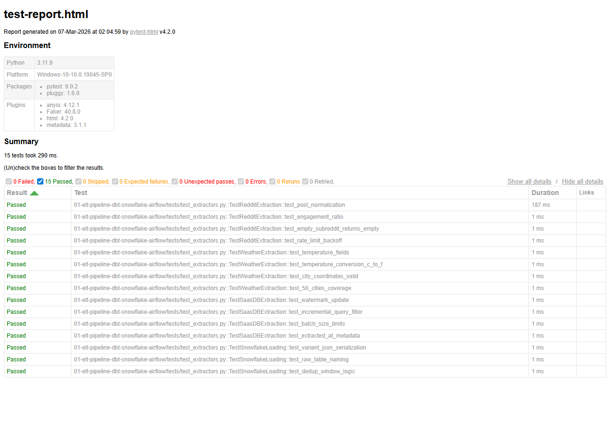

# Automated ELT Pipeline with dbt + Snowflake + Airflow


A production-grade ELT pipeline that extracts data from multiple public APIs (Reddit, OpenWeather, and a SaaS PostgreSQL database), loads raw data into Snowflake, and transforms it using dbt with full testing, documentation, and lineage. Apache Airflow orchestrates the daily refresh, with CI/CD via GitHub Actions and Slack alerting on failures.

## Demo


*Pipeline execution dashboard showing Airflow DAG status, extraction metrics, dbt model lineage, and terminal output*

## Architecture

```
+-----------------+     +-----------------+     +-----------------+
|   Reddit API    |     | OpenWeather API |     |  PostgreSQL DB  |
|  (PRAW/httpx)   |     |   (REST/JSON)    |     |  (SaaS Source)  |
+--------+--------+     +--------+--------+     +--------+--------+
         |                       |                       |
         +-----------+-----------+-----------+-----------+
                     |                       |
                     v                       v
            +---------------------------------------+
            |         Python Extractors             |
            |   (Async httpx + rate limiting)       |
            +-------------------+-------------------+
                                |
                                v
            +---------------------------------------+
            |      Snowflake Raw Schema             |
            |   (RAW_REDDIT, RAW_WEATHER,           |
            |    RAW_SAAS)                          |
            +-------------------+-------------------+
                                |
                                v
            +---------------------------------------+
            |          dbt Transformations          |
            |                                       |
            |  Staging -> Intermediate -> Marts     |
            |                                       |
            |  * not_null / unique tests            |
            |  * accepted_values tests              |
            |  * freshness checks                   |
            |  * Full lineage graph                 |
            +-------------------+-------------------+
                                |
                                v
            +---------------------------------------+
            |        Analytics / Dashboards         |
            |     (Metabase / Looker Studio)        |
            +---------------------------------------+

            Orchestration: Apache Airflow (Daily DAG)
            CI/CD: GitHub Actions (dbt test on PR)
            Alerting: Slack Webhooks
```

## Key Business Insights

1. **Reddit Sentiment Trends**: Track subreddit activity, post sentiment, and engagement patterns over time to identify trending topics and community health metrics.
2. **Weather-Correlated Behavior**: Join weather data with Reddit activity to uncover how weather patterns influence online engagement - a cross-domain analytical insight that demonstrates real business value.

## Tech Stack

| Component | Technology |
|-----------|-----------|
| Extraction | Python 3.9+, httpx, PRAW, psycopg2 |
| Loading | Snowflake Connector for Python |
| Transformation | dbt Core 1.7+ |
| Orchestration | Apache Airflow 2.7+ |
| Warehouse | Snowflake |
| CI/CD | GitHub Actions |
| Alerting | Slack Webhooks |
| Dashboards | Metabase / Looker Studio |
| Containerization | Docker + Docker Compose |

## Project Structure

```
|-- dags/                          # Airflow DAG definitions
|   |-- elt_daily_pipeline.py      # Main daily ELT DAG
|   |-- dbt_run_dag.py             # dbt-specific DAG
|-- dbt_project/                   # dbt project root
|   |-- models/
|   |   |-- staging/               # 1:1 source mappings, cleaning
|   |   |-- intermediate/          # Business logic joins
|   |   |-- marts/                 # Final analytics tables
|   |-- tests/                     # Custom data tests
|   |-- macros/                    # Reusable SQL macros
|   |-- seeds/                     # Static reference data
|   |-- snapshots/                 # SCD Type 2 snapshots
|-- extractors/                    # Python extraction modules
|   |-- reddit_extractor.py
|   |-- weather_extractor.py
|   |-- saas_db_extractor.py
|-- loaders/                       # Snowflake loading modules
|   |-- snowflake_loader.py
|-- config/                        # Configuration files
|   |-- settings.py
|-- scripts/                       # Setup & utility scripts
|   |-- setup_snowflake.sql
|   |-- setup_airflow.sh
|-- tests/                         # Python unit tests
|-- .github/workflows/             # CI/CD pipelines
|   |-- dbt_ci.yml
|-- docker-compose.yml
|-- Dockerfile
|-- requirements.txt
|-- .env.example
```

## Setup Instructions

### Prerequisites

- Python 3.9+
- Docker & Docker Compose
- Snowflake account (free trial works)
- Reddit API credentials
- OpenWeather API key (free tier)
- Slack webhook URL (optional)

### 1. Clone & Configure

```bash
git clone https://github.com/shashank-thimmegowda/elt-pipeline-dbt-snowflake-airflow.git
cd elt-pipeline-dbt-snowflake-airflow
cp .env.example .env
# Edit .env with your credentials
```

### 2. Set Up Snowflake

```bash
# Run the Snowflake setup script in your Snowflake worksheet
# or use snowsql:
snowsql -f scripts/setup_snowflake.sql
```

### 3. Install Dependencies

```bash
python -m venv venv
source venv/bin/activate  # Windows: venv\Scripts\activate
pip install -r requirements.txt
```

### 4. Initialize dbt

```bash
cd dbt_project
dbt deps
dbt seed
dbt run
dbt test
```

### 5. Start Airflow (Docker)

```bash
docker-compose up -d
# Access Airflow UI at http://localhost:8080
# Default credentials: airflow / airflow
```

### 6. Enable the DAG

Navigate to Airflow UI -> enable "elt_daily_pipeline" DAG -> trigger manually or wait for schedule.

## Test Results

All unit tests pass - covering extraction logic, data normalization, incremental watermarks, Snowflake loading patterns, and dedup window functions.



**15 tests passed** across 4 test suites:
- "TestRedditExtraction" - post normalization, engagement ratio, rate limiting
- "TestWeatherExtraction" - temperature fields, C to F conversion, city coordinates
- "TestSaasDBExtraction" - watermark updates, incremental queries, batch sizing
- "TestSnowflakeLoading" - VARIANT JSON serialization, dedup logic

## CI/CD

Every pull request triggers:
1. "dbt compile" - validates SQL syntax
2. "dbt test" - runs all data tests against a CI schema
3. Linting via "sqlfluff"

## Maintainer

Shashank Thimmegowda is a Snowflake Data Engineer with 5 years of experience in designing, optimizing, and managing scalable ETL/ELT data pipelines. He specializes in integrating diverse data sources using Python, SQL, and dbt to transform raw data into actionable business insights.

* Email: shashank.thimmegowda97@gmail.com
* LinkedIn: https://www.linkedin.com/in/shashank-thimmegowda-97/

## License

MIT